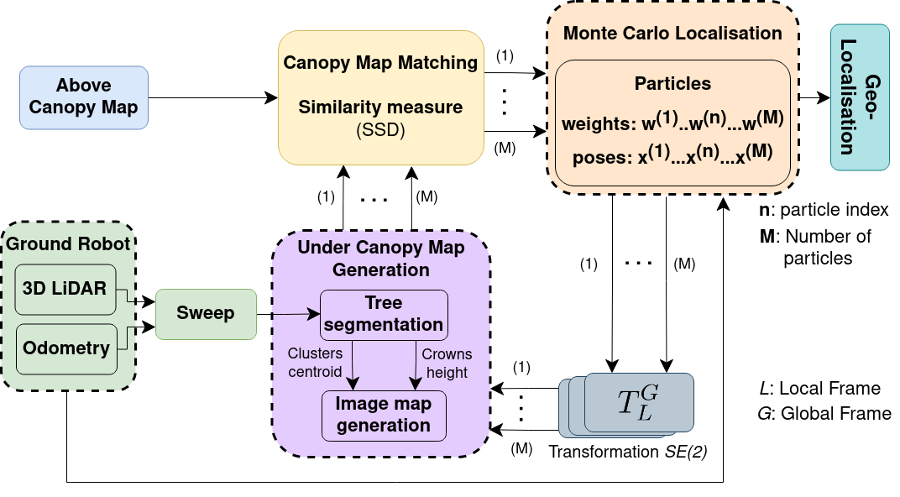

# Forest_Localisation

This repository contains the open-source implementation of the localisation method for forest environments published in RAL 2023:

- [Air-Ground Collaborative Localisation in Forests Using Lidar Canopy Maps](https://doi.org/10.1109/LRA.2023.3243498)

We presented a collaborative localisation framework that matches an Above Canopy Map (ACM) (captures height information) collected from aerial lidar scans, as a reference
map, with Under Canopy Maps (UCM) constructed from sensed trees (positions and crown heights) using mobile lidar data from the ground robot system. Experimental evaluation on distinct forest environments and platforms demonstrated the method is effective in geo-localising robots with low position errors. 

## Method overview


- Obtain the Above Canopy Map (ACM): Heightmap constructed from aerial lidar data
- Tree detection and estimation of position and crown height to construct the local Under Canopy Maps (UCM)
- Map Matching between the ACM and UCMs using the SSD similarity measure
- Monte Carlo Localisation implementation to estimate the robot positions using the Map Matching scores and the robot's motion model 


## Installation

### Requirements
Install the following packages (dependencies) to build this project:
- [ROS](https://www.ros.org/) (Noetic)
- [PCL](https://pointclouds.org/downloads/) (1.10.0)
- [Eigen](https://eigen.tuxfamily.org/dox/GettingStarted.html) (3.3.7-2)
- [OpenCV](https://opencv.org/) (4.2.0)

Install the following ROS packages (dependencies) to build this project:

- Install the robot-localization ros package
```bash
sudo apt-get install -y ros-noetic-robot-localization
```
Many dependencies such as (tf2, tf2_ros, geometry_msgs, sensor_msgs, etc) will be installed along with the robot-localization.

- Install other ros package dependencies:
```bash
sudo apt-get install -y ros-noetic-pcl-ros
sudo apt-get install -y ros-noetic-cv-bridge
```

- Install [linefit_ground_segmentation](https://github.com/lorenwel/linefit_ground_segmentation) ros package


Clone and install the project:
```bash
git clone https://github.com/csiro-robotics/Forest_Localisation.git
catkin build pfilter_localization
```

### Dataset

- Download the dataset from: [Forest Localisation Dataset](https://doi.org/10.25919/fbwy-rk04)
- Copy the dataset folder `forestI` to the project folder `(your_catkin_ws)/forest_localisation/datasets/` 


### Running the code

Launch the main node:
```bash
roslaunch forest_localisation pfilter.launch
```

Launch the rviz nodes for visualisation:
```bash
roslaunch forest_localisation pfilter_rviz.launch
```
To visualise the ACM and UCM images, launch the ROS rqt_image_vew node:
```bash
rqt_image_vew
```
then, select the topic `/map_local_images` for visualisation.  

Play the rosbag file:
```bash
cd (you_catkin_ws)/forest_localisation/datasets/forestI/
rosbag play forestI.bag
```

### Parameters

The parameters are set in the `/config/forestI_config.yaml` file. Please refer to the file for more details. 


## Citation

If you use any of this code and/or find this work helpful to your research, please cite:

```
@ARTICLE{Lima23,
  author={de Lima, Lucas Carvalho and Ramezani, Milad and Borges, Paulo and Brünig, Michael},
  journal={IEEE Robotics and Automation Letters},
  title={Air-Ground Collaborative Localisation in Forests Using Lidar Canopy Maps}, 
  year={2023},
  volume={},
  number={},
  pages={1-8},
  doi={10.1109/LRA.2023.3243498}}

```

## Acknowledgment
Functions or code snippets from 3rd party have been acknowledged at the respective function definitions.

## Contact
For questions or feedback:
 ```
 lucas.lima@data61.csiro.au
 ```
